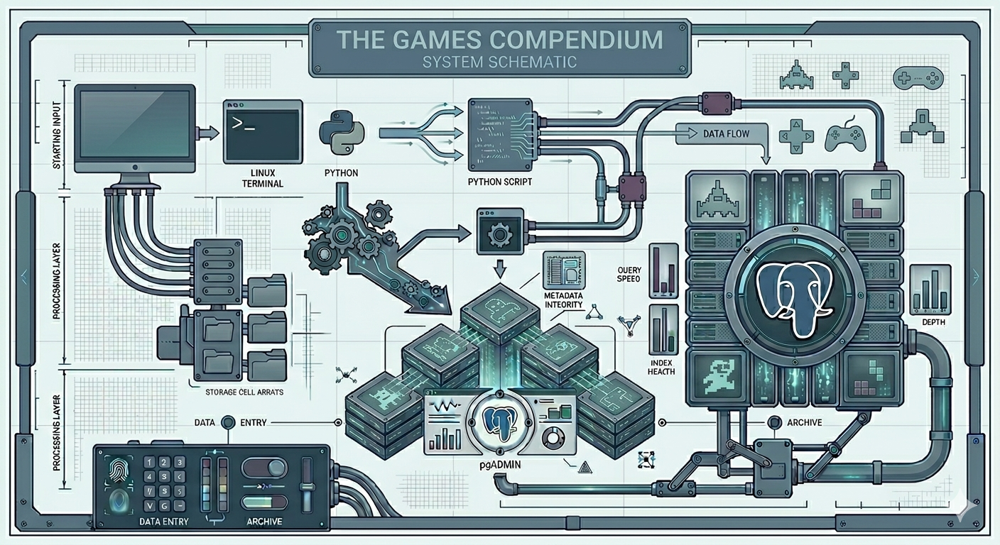

# 🎮 Games Compendium

## Folder Contents 

|Description |

Folder 2:

Overview Statement:

"A specialized database system for archiving video game collections. This project showcases the use of Python scripts to interface with a relational PostgreSQL database, providing the user with the ability to track titles across multiple platforms and generate platform-specific inventory counts."

| :--- | :--- | 
| **Scripts** | Python CRUD operations for book management |
| **ERD**     | Database entity relationship diagram |
| **Output**  | Screenshots of terminal grid results |