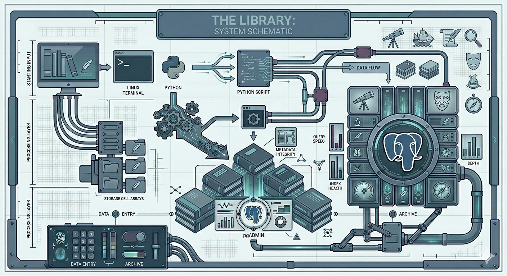

# 📚 Library Flagship 8++

## Folder Contents 

|Description |

Folder 1: The Library (Books)

Overview Statement:

"This collection features a suite of Python-driven database tools designed to catalogue and manage a personal library of books. Utilizing a PostgreSQL backend on a Linux environment, this tool allows for structured data entry, genre-based categorization, and automated summary reporting."

| :--- | :--- | 
| **Scripts** | Python CRUD operations for book management |
| **ERD**     | Database entity relationship diagram |
| **Output**  | Screenshots of terminal grid results |