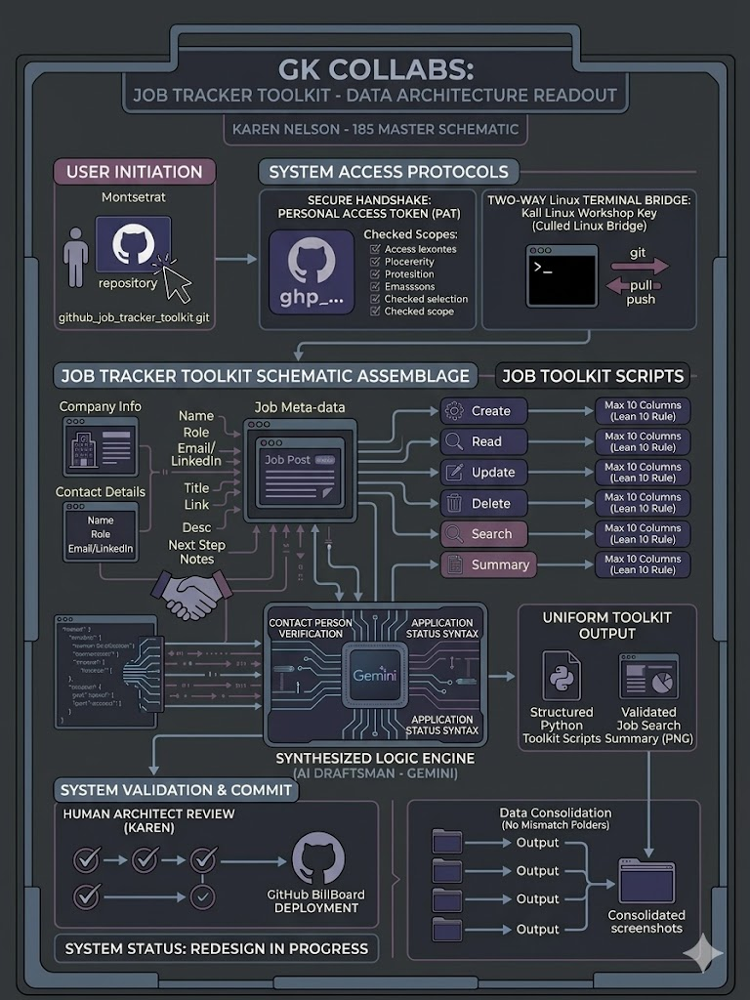

README.md

# 💼 Job Tracker Toolkit

Overview Statement:

"One of a series of databases created, designed, and built with the GK Collabs Core Six™ concept.

The GK Collabs Core Six™ concept consists of scripts that are simple, clean and fully functional scripts which have six functions that cover the purposes of a good and functioning database.

This is a professional suite of Python utilities designed to manage and track job applications within a PostgreSQL database. Built in a Linux (Debian) environment, this toolkit automates the CRUD (Create, Read, Update, Delete) cycle for career management and also features search and summary functions."

| **Core Six™** | The GK Collabs Core Six™ concept | 
| **Scripts** | Python CRUD, search and summary operations for managing important job applications | 
| **ERD** | Database entity relationship diagram | 
| **Output** | Screenshots of terminal grid results |
